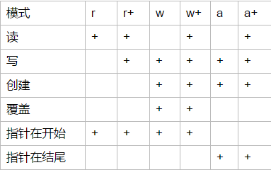

注意：
```
readme.md文件(名称必须是readme)会直接显示在github目录下面。

在文件中写中文方法的原因是为了便于在structure中快速查找。

添加很多 if 0 的原因是为了开关部分代码，而不是选中然后注释。
setting-搜索inspections-Python-取消勾选unreachable code
（虽然不规范，但能提高效率）
```
## 参考

[廖雪峰的官方网站](https://www.liaoxuefeng.com/wiki/0014316089557264a6b348958f449949df42a6d3a2e542c000)

[菜鸟教程](http://www.runoob.com/python3/python3-tutorial.html)

[Python3.7官方文档](https://docs.python.org/3/tutorial/index.html)

## 准备工作
[markdown语法](markdown语法.md)

[python编码规范](python编码规范.md)


## 数据结构
[数字](number_demo.py)

[字符串](string_demo.py)

[列表](list_demo.py)

[元组](tuple_demo.py)

[集合](set_demo.py)

[字典](dictionary_demo.py)


## 控制流工具
[if语句](if_demo.py)

[循环语句](for_demo.py)
> 包括 while, for, pass, Range, 迭代器, 生成器.

[函数](function_demo.py)
> 传递不可变对象，传递可变对象，默认参数， 不定长参数，
> Lambda表达式，return语句，变量作用域， 数据类型转换， 关键字参数，
> 命名关键字参数， 参数组合。

[函数式编程](function_demo2.py)
> 高阶函数() map函数() reduce函数() map_reduce练习() filter函数()
> 排序算法() 函数作为返回值() Lambda表达式() 闭包() 装饰器() 装饰类练习()
> 偏函数()

## 其他
[输入输出函数](print_and_input_demo.py)



json暂时跳过
http://www.runoob.com/python3/python3-json.html

[模块](module/test1/demo03.py)
> 以及 [demo04](module/test1/demo04.py) [demo05](module/test2/demo05.py)

[标准库概览](demo10.py)

[正则表达式](regexp_demo.py)

[日期和时间的使用](data_and_calendar_demo.py)

## 小而皮的Bug
- unindent does not match any outer indentation level
  肯定是报错的附近代码没有对齐，或者Tab和空格混用。 View-Active edit-show
  Whites space，看看有没有问题。细心点，有时候只是一个空格导致的。
- 


